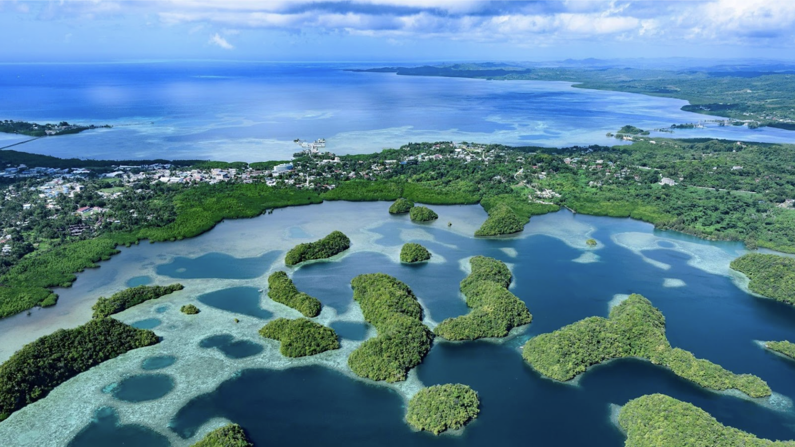
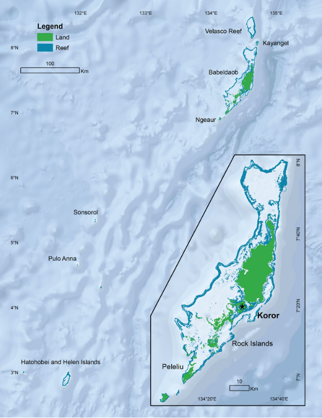

# Palau Climate Change Monitor: 2024 

 
This report was produced by NOAA’s National Centers for Environmental Information (NCEI) working in partnership with the Palau Office of Climate Change and other agencies, organizations and institutions in the **Republic of Palau**.  It draws on the latest meteorological and oceanographic data from published sources and applies established analytical techniques to document observed long-term changes in climate in and around the Republic of Palau.  It also includes projections of future changes in climate in the vicinity of Palau. It is intended to inform decision-makers seeking to better understand a changing climate, assess its impacts on people’s lives and livelihoods, and prioritize their actions to adapt. 
 
The state of knowledge about rapid climate change in and around Palau is characterized via a set of **environmental indicators**.  Attention is given to two broad categories of indicators: the atmosphere and the ocean, each in separate sections with individual indicators.  Important information about each indicator is summarized and shown graphically using multiple measures, reflecting different data sources and/or different ways to characterize the data.  

🌤 **Atmosphere:** CO2, Surface temperature, rainfall, tropical cyclones 
🌊 **Ocean:** Sea level, ocean temperature, biochemistry

